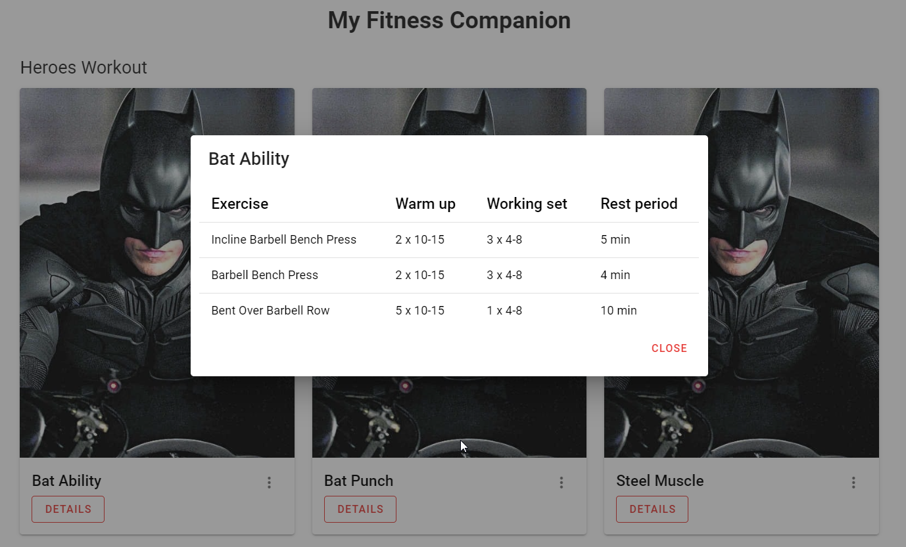
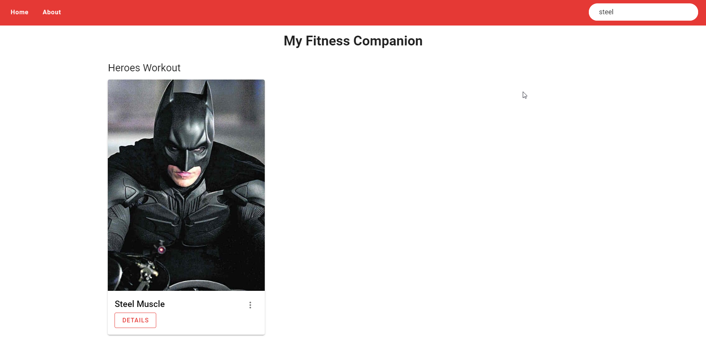

# Hacktiv8 Web App Development
# Fitness Companion Apps

Pada projek _Fitness Companion Apps_ ini, terdapat beberapa hal sebagai berikut:

1. Aplikasi ini adalah aplikasi yang dapat mengatur workout harian
2. Aplikasi ini menampilkan detail workout berdasarkan card yang tersedia
3. Projek ini menitikberatkan penggunaan **Vue** untuk memaintain aspek frontend dan **Express** untuk memaintain aspek backend nya

Project ini dimulai menggunakan vue framework pada front-end, express pada back-end, dan vuetify untuk _css styling_.

## Menjalankan applikasi
### Menjalankan client-side
 - masuk ke directory client, kemudian execute __npm run serve__, client dijalankan pada port 8080

### Menjalankan server-side
 - masuk ke directory server, kemudian execute __npm start__, server dijalankan pada port 8081

## App Functionality

**1. Menampilkan 2 card atau button untuk menuju ke Personal Workout dan Heroes Workout.**

- Personal Workout adalah list workout yang diperuntukkan untuk user personal.
- Sedangkan Heroes Workout adalah rangkaian workout yang tersedia dengan nama-nama superhero (seperti Batman Workout yang berisikan: 20 squats, 40 punches, etc).

**2. Saat user mengakses Personal Workout, user mendapatkan tampilan seperti berikut**

- User mendapatkan daftar personal workout yang data JSON-nya diambil dari backend menggunakan fetch API dan checkbox pada setiap workout yang dapat di-checklist ketika workout sudah dikerjakan.

**3. Ketika user mengakses Heroes Workout (Hero Workout), user mendapatkan tampilan seperti berikut**

- Daftar workouts yang diatur (Heroes) dengan data berupa JSON yang diambil dari backend menggunakan fetch API.
- Setiap workout berisikan gambar, judul workout, dan button "details".
- Workout detail berbentuk modal
- Ketika button details diklik, dan memunculkan modal:

**4. Halaman Heroes Workout juga memiliki search form, di mana search form ini berguna untuk mencari Heroes Workout tertentu dan melihat detailnya, seperti gambar di bawah ini:**

- Search form tersebut memiliki text input yang dapat digunakan untuk langsung mem-filter workout. Saat value yang ada pada text input berubah, workout yang cocok dengan inputan tersebut akan muncul.

Demikian project My Travel Website ini saya buat.
Feel free to comment and give an input

**Farid Rahman**

fr.farid.rahman@gmail.com